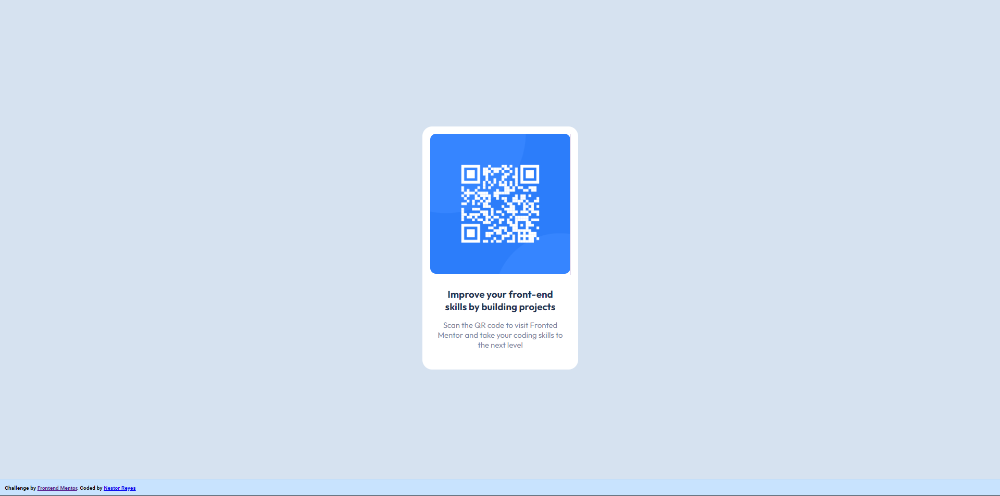
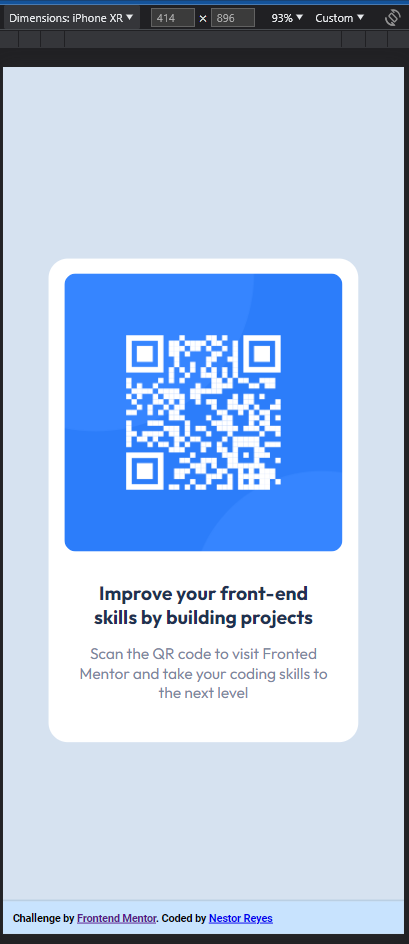

# Frontend Mentor - QR code component solution

This is a solution to the [QR code component challenge on Frontend Mentor](https://www.frontendmentor.io/challenges/qr-code-component-iux_sIO_H). Frontend Mentor challenges help you improve your coding skills by building realistic projects. 

## Table of contents

- [Overview](#overview)
  - [Screenshot](#screenshot)
  - [Links](#links)
- [My process](#my-process)
  - [Built with](#built-with)
  - [What I learned](#what-i-learned)
  - [Continued development](#continued-development)
- [Author](#author)
- [Acknowledgments](#acknowledgments)

**Note: Delete this note and update the table of contents based on what sections you keep.**

## Overview

### Screenshot

- **_Desktop Version:_** 
  
- **_Mobile Version:_**
    

### Links

- Solution URL: [Link Here](https://github.com/Reyesnes/Frontend-Mentor-Challenges/tree/main/chllg01_qr-code-component)
- Live Site URL: [Link Here>](https://reyesnes.github.io/Frontend-Mentor-Challenges/chllg01_qr-code-component/)

## My process

- First design how the containers were to be structured.
- Then define the type of construction I was going to use, either with "div" containers or do it in a semantic way.
- First I worked on as many containers as possible, and then I worked on the elements.
- Then I proceeded to apply the html styles in css.

### Built with

- Semantic HTML5 markup
- CSS custom properties
- Flexbox, especially with `display: flex`


### What I learned

The most tedious part of working on this project was the CSS styling. It was super complicated to make the application responsive on all types of devices, and without a doubt, this is the biggest learning I take from this project.

I never gave up until I achieved the expected result of the project.

The biggest learning I take away from this project is:
- the flexbox styles, especially display: flex
- being able to center the content horizontally and vertically on the whole page with 'justify-content: center' and 'align-items: center'.
- Deep learning about min and max measures.

**En HTML** I moved the attribution to a semantic container `<footer>`

 - **_Antes:_**
```html
<div class="attribution">
    Challenge by <a href="https://www.frontendmentor.io?ref=challenge" target="_blank">Frontend Mentor</a>.
    Coded by <a href="#">Nestor Reyes</a>
</div>

```

- **_Ahora:_**
```html
<footer class="footer">
  <div class="attribution">
    Challenge by <a href="https://www.frontendmentor.io?ref=challenge" target="_blank">Frontend Mentor</a>.
    Coded by <a href="#">Nestor Reyes</a>
  </div>
</footer>
```

También en **HTML** utilicé varios contenedores semánticos como `<main>`,`<section>`, `<figure>`
```html
<main class="parent-container" id="parent-container__about-qr-code">

  <section class="qr-code__sectionContainer">
    <figure class="qr-code__figureContainer">
      <a href="https://www.frontendmentor.io/home" target="_blank">
        
      </a>
      <figcaption class="qr-code__textContainer">
        <h1 class="qr-code__title">Improve your front-end <br>
                                   skills by building projects
        </h1>
        <p class="qr-code__description">
          Scan the QR code to visit Fronted <br>
          Mentor and take your coding skills to <br>
          the next level
        </p>
      </figcaption>
    </figure>
  </section>

</main>
```


**In CSS** I applied `flexbox` styles, `min` & `max` measures, center content with `justify-content` and `align-items`.

```css
body {
  display: flex;
  min-width: 375px;
  min-height: 668px;
  justify-content: center; /* Center horizontally */
  align-items: center; /* Center vertically */
}
```

### Continued development

By profession I am a Finance and Accounting professional, and a Data Analyst.

Now I am learning a bit about Frontend Development, therefore, I would like to continue specializing in this area. First I want to polish my skills in CSS and the corresponding libraries, and then start learning JavaScript.


## Author

- Website - [Nestor Reyes](https://www.your-site.com)
- Portfolio Github - [@Reyesnes](https://github.com/Reyesnes)
- Twitter - [@ReyesNes1993](https://twitter.com/ReyesNes1993)


## Acknowledgments

A big thank you to the Fronted Mentor team, who had this wonderful idea of providing us with this type of challenge, which helps us in our practice and without a doubt, helps us to improve our portfolio of projects.
